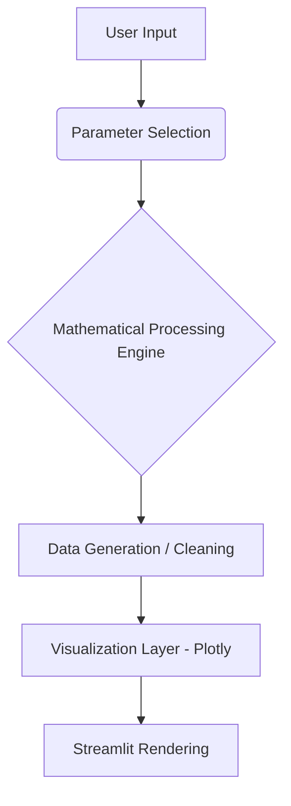

# 📈 Crypto Volatility Visualizer

An interactive financial analytics dashboard built using **Streamlit, Pandas, NumPy, and Plotly** to simulate and analyze cryptocurrency market volatility using mathematical models and real OHLCV data.

**Student Name:** Naman Om Shrestha
**Student ID:** 1000432 
**Course:** Artificial Intelligence  
**Focus:** Mathematics for AI-I
**Assessment Type:** Formative Assessment 2 (FA-2)  

---

## 🚀 Live Demo

🔗 https://idai104-1000432-naman-om-shrestha.streamlit.app

---

## 🧠 Project Overview

Crypto Volatility Visualizer connects mathematical functions to real-world financial behavior.  

The application allows users to:

- Simulate cryptocurrency price movements
- Analyze real 1-minute Bitcoin OHLCV data (1M+ rows)
- Measure volatility and trend direction
- Compare stable vs volatile market conditions
- Visualize trading behavior interactively

---

## 🎨 UI/UX Planning & Storyboard

This project involved careful pre-planning of the user experience, layout structure, and component behavior to ensure a smooth and intuitive workflow. You can view the complete design storyboard, wireframes, and skill planning here:

🔗 Storyboard Access Link : **[View Project Storyboard on Canva](https://www.canva.com/design/DAHCHDLEk34/kGF6D75_VxCHVCr2msyo2g/edit)**


---

## ✨ Features

### 🔹 Market Simulation Engine
Users can generate synthetic price data using:

- **Sine Wave Model** (market cycles)
- **Cosine Wave Model**
- **Random Noise Model** (market shocks)

Adjustable parameters:

- Amplitude (Volatility level)
- Frequency (Trading intensity)
- Drift (Market trend direction)
- Comparison Mode (Side-by-side visualization)

---

### 🔹 Real Dataset Analysis

Supports three data sources:

1. Preloaded demo dataset
2. Google Drive-hosted BTC dataset (1M+ rows)
3. Custom CSV upload (OHLCV format)

The app performs:

- Unix timestamp → datetime conversion
- Column renaming and cleaning
- Missing value detection
- Volatility calculation (`High - Low`)
- Statistical summary generation

---

### 🔹 Interactive Visualizations

Built with Plotly:

- Close Price Trend
- High vs Low Band
- Volume Chart
- Stable vs Volatile Detection
- Side-by-Side Comparison Mode

All charts include:

- Proper axis labels
- Hover tooltips
- Zoom and pan support
- Dynamic filtering

---

## 🖼️ App Screenshots

| Onboarding Screen | Login Screen | Signup Screen |
| :---: | :---: | :---: |
|  |  |  |
| **Demo Page** | **Forget Password** | **Dashboard** |
|  |  |  |
| **Controls** | **Simulation Setting** | **Real Dataset** |
|  |  |  |
| **Math Concept 2** | **Math Concept 3** | **Edit Profile** |
|  |  |  |
| **Feedback** | **Loading Screen** | **Dataset Summary** |
|  |  |  |
| **Math Concept 1** | | |
|  | | |

---

## 🧮 Mathematical Models

| Concept | Formula / Representation | Market Meaning |
|---------|-------------------------|----------------|
| **1-min Volatility** | `High − Low` | Statistics / Real market risk measurement |
| **Sine price cycle** | `y = A·sin(f·x) + drift·x` | Predictable cyclical bull/bear phases |
| **Cosine price cycle** | `y = A·cos(f·x) + drift·x` | Cycle starting at market peak |
| **Random Noise** | `y = N(0,A) + drift·x` | Sudden news-driven shocks (closest to BTC) |
| **Bull market** | `drift > 0` | Long-term upward trend |
| **Bear market** | `drift < 0` | Long-term downward trend |
| **Volatility index σ** | `√(Σ(x−μ)²/n)` | Differentiates high-risk vs safe assets |

---

| Parameter | Meaning | Market Interpretation |
|-----------|----------|----------------------|
| Amplitude (A) | Wave height | Size of price swings |
| Frequency (f) | Wave speed | Trading activity |
| Drift | Linear slope | Bull/Bear market trend |
| Std Dev (σ) | Spread of values | Volatility index |

---

## 📊 Dataset

**File:** btcusd_1-min_data.csv  
**Google Drive Link:** [Dataset Download Link](https://drive.google.com/file/d/1BXxft5n2Hf8amI4cVtm4TfCrDKf-S45L/view?usp=sharing)

- Format: OHLCV
- Frequency: 1-minute intervals
- Size: ~1,048,576 rows
- Period: January 2012 – Present
- Source: Kaggle public dataset

| Column | Description |
|--------|-------------|
| Timestamp | Unix seconds since Jan 1, 1970 |
| Open | Opening price |
| High | Highest price |
| Low | Lowest price |
| Close | Closing price |
| Volume | Trading volume |

---

## 🛠 Tech Stack

**Frontend**
- Streamlit

**Data Processing**
- Pandas
- NumPy

**Visualization**
- Plotly

**Deployment**
- Streamlit Cloud

---

## 📁 Project Structure

```bash
IDAI104-1000414-ADITYA-JITENDRA-KUMAR-SAHANI/
│
├── assets/
│   └── App Screenshots/
├── app.py
├── requirements.txt
└── README.md
```

---

---

## ⚙ Installation & Local Setup

### Clone Repository

```bash
git https://github.com/adityasahani392217/IDAI104-1000414-ADITYA-JITENDRA-KUMAR-SAHANI
cd  IDAI104-1000414-ADITYA-JITENDRA-KUMAR-SAHANI
```
### Install Dependencies

```bash
pip install -r requirements.txt
```

### Run Application
```bash
streamlit run app.py
```
---

### 🌐 Deployment

1. **Push project to GitHub:**
   ```bash
   git add .
   git commit -m "Initial commit"
   git push origin main
   ```
2. **Connect repository to Streamlit Cloud:**
   - Go to [share.streamlit.io](https://share.streamlit.io/)
   - Click "New app"
   - Select your repository, branch, and file path
3. **Select `app.py` as entry point.**
4. **Deploy and share URL!**

---

### 🏗 System Architecture



---
### 📚 Learning Outcomes

This project demonstrates:

- Financial time-series visualization
- Mathematical modeling of markets
- Data pipeline creation
- Large dataset handling (1M+ rows)
- Interactive dashboard design
- Cloud deployment workflow

---

### 👥 Collaborators

| Name | WACP NO |
|------|---------|
| Aditya Jitendra Kumar Sahani | 1000414 |
| Zene Sophie Anand | 1000442 |
| Naman Om shreshta | 1000432 |

---

### 📄 License

This application was exclusively developed for academic assessment and portfolio demonstration. It serves as an open-source technical showcase demonstrating applied mathematical modeling, algorithmic financial analysis, and large-scale data visualization in a practical software setting.

